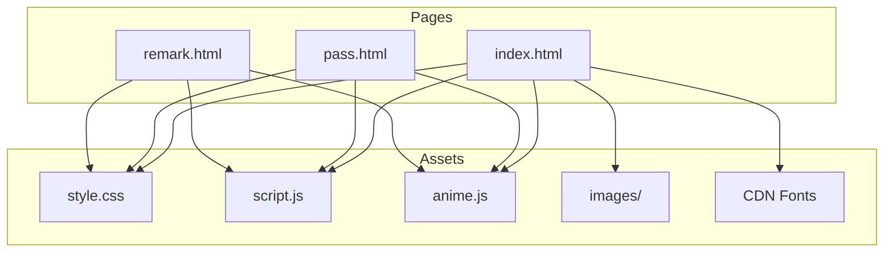

##history-of-the-creation-of-minecraft — Документация проекта

### 1. Структура проекта

```
final.github.io-main/
├─ index.html                # Главная страница с контентом и навигацией
├─ pass.html                 # Страница входа администратора
├─ _reg.html                 # Альтернативная/черновая страница входа (дубликат pass.html)
├─ remark.html               # Черновая «админ-страница» с текстовыми полями HTML/CSS
├─ style.css                 # Стили, темы (светлая/тёмная), адаптив, анимации появления
├─ script.js                 # Клиентская логика: скролл, «бургер», ховер-анимации, «логин»
├─ anime.js                  # Локальная библиотека анимаций anime.js v3.2.1 (MIT)
├─ images/                   # Статические изображения для контента и оформления
│  ├─ maineheader.jpg
│  ├─ Minefooter.jpeg
│  ├─ tile_background.png
│  ├─ CaveGame.png
│  ├─ Human_Mob.png
│  ├─ Скалы.png
│  ├─ крестик.png
│  ├─ земля.png
│  ├─ камень.png
│  ├─ доски.png
│  ├─ логотип1.png
│  └─ пиксельарт.png
└─ README.md                # Этот файл: документация проекта
```

### 2. Описание файлов

- index.html
  - Назначение: Главная страница с историей разработки Minecraft и навигацией.
  - Ключевые элементы: `header`, две навигации (`.menu` и мобильная `.menu_small_*`), несколько `article.block` с контентом.
  - Связи: подключает `style.css`, CDN-шрифты, `anime.js`, `script.js`; использует изображения из `images/`.
  - Логика: якорные ссылки с классом `.scroll` для плавного скролла; ссылка «Редактировать» ведёт на `pass.html`.

- pass.html
  - Назначение: Форма входа администратора.
  - Ключевые элементы: два поля `input` (логин/пароль), кнопка `.log`, контейнер `.error`.
  - Связи: подключает `style.css`, `anime.js`, `script.js`; при успешном «входе» перенаправляет на `remark.html`.
  - Логика: обработчик `handle()` из `script.js` считывает значения полей, сравнивает с жёстко заданными учётными данными.

- _reg.html
  - Назначение: Альтернативная (видимо устаревшая) версия страницы входа; структура совпадает с `pass.html`.
  - Связи/логика: Аналогичны `pass.html`.

- remark.html
  - Назначение: Черновая «админ-страница» для визуального просмотра/редактирования исходников; содержит два больших `textarea` с текстом `index.html` и `style.css`.
  - Ключевые элементы: навигация как на главной, секции `#html` и `#css`, кнопки «Сохранить» (без реализованного обработчика).
  - Связи: подключает те же стили/скрипты; повторно использует «бургер»-меню и аним. эффекты.
  - Логика: фактического сохранения нет; кнопки не привязаны к коду. Страница служит скорей как просмотрщик исходников.

- style.css
  - Назначение: Оформление, тема, сетка, адаптив и эффекты появления элементов при прокрутке.
  - Ключевые блоки:
    - CSS-переменные и «чекбокс-хак» для смены темы: `:root` + `input:checked~*` переключают цвета и иконку (`images/moon.png`/`images/sun.png`).
    - Базовые стили для `header`, `main`, `.block`, заголовков, изображений, меню.
    - Эффекты появления: начальные `transform`/`opacity` для текстов и изображений с плавным проявлением.
    - Адаптив: медиа-запросы для показа «бургер»-меню на ширинах < 767px.
  - Связи: ожидает HTML-структуру с классами `.menu_small_icon`, `.menu_small_item`, `.block`, и др.

- script.js
  - Назначение: Поведение интерфейса.
  - Ключевые функции/обработчики:
    - Плавный скролл по клику на `.scroll` (использует `Element.scrollIntoView`).
    - `handle()`: считывает все `input`, сравнивает первые два значения с `adm1 = ['admin', '123234']`; при успехе `window.location.href = 'remark.html'`, иначе пишет ошибку в `.error`.
    - «Бургер»-меню: клик по `.menu_small_icon` анимирует появление/скрытие `.menu_small_item` через `anime()`.
    - Ховер-анимация изображений: `scale` с помощью `anime()` при наведении/уходе курсора.
    - Отложенное появление текстов и картинок при скролле: вычисление позиции блока в `checkBlocksVisibility()` и установка `opacity/transform`.
  - Особенности/замечания:
    - В проверке логина используется побитовое «&» вместо логического «&&»: `if ((a == ...) & (b == ...)) { ... }` — работает за счёт неявного приведения, но лучше заменить на `&&` для читаемости и корректности.
    - `signIn.setHTML = input_values[0];` — не влияет на DOM; вероятно имелось в виду `textContent`/`innerHTML`.
    - Присутствует защитный `try/catch` вокруг назначения обработчика `.log` (кнопки), в то время как в `pass.html` уже задан `onclick="handle()"`.
  - Связи: зависит от глобальной функции `anime()` из `anime.js`.

- anime.js
  - Назначение: Локальная копия библиотеки анимаций `anime.js` v3.2.1 (MIT).
  - Ключевые API: `anime({...})`, `anime.timeline`, `anime.stagger`, `anime.path`, набор функций «easing» и пр.
  - Связи: используется в `script.js` для анимаций меню и изображений.

- images/
  - Назначение: Статические изображения для иллюстраций и оформления (фон, иконки и т.д.).

### 3. Архитектура проекта

- Общая структура
  - Проект — статический фронтенд-сайт без бэкенда. Все данные/состояния находятся на клиенте.
  - Страницы: публичная (`index.html`) и две служебные (`pass.html` и `remark.html`).
  - Навигация: по якорям и через гиперссылки между страницами.

- Потоки данных
  - Пользовательские события (клики, наведение, скролл) → обработчики из `script.js` → изменения DOM/стилей и анимации.
  - «Авторизация»: поля ввода → `handle()` → сравнение со статическим массивом `adm1` → при успехе редирект на `remark.html`.

```mermaid
flowchart LR
  A[Пользователь] -->|Открывает| B[index.html]
  B -->|Клики по .scroll| C[scrollIntoView]
  B -->|Клик по Редактировать| D[pass.html]
  D -->|Ввод логина/пароля| E[script.js: handle()]
  E -->|adm1 совпал| F[redirect → remark.html]
  E -->|ошибка| G[.error в pass.html]
  B -->|Моб. меню клик| H[anime(): показать .menu_small_item]
  B -->|Ховер по img| I[anime(): scale]
  B -->|Скролл| J[checkBlocksVisibility() → стили]
```



### 4. Библиотеки/фреймворки

- anime.js (локально, `anime.js`)
  - Назначение: декларативные анимации DOM/CSS/SVG.
  - Где используется: «бургер»-меню, ховер-анимации изображений.

- jQuery (CDN)
  - Назначение: удобные утилиты/DOM-манипуляции.
  - Где используется: подключён, но по коду `script.js` непосредственно не используется.

- Google Fonts и fontlibrary.org (CDN)
  - Назначение: шрифты `Dancing Script` и «Minecraft» (`MinecrafterAltRegular`).
  - Где используется: заголовки и декоративные стили в `style.css`.

### 5. Точка входа и запуск

- Запуск
  - Откройте файл `index.html` в современном браузере (двойной клик или через локальный сервер).
  - Для корректной загрузки шрифтов по CDN интернет-соединение должно быть доступно.

- Что выполняется первым
  - Загружаются стили и шрифты; строится DOM.
  - При `DOMContentLoaded` и `load` `script.js` регистрирует обработчики (скролл, клики, ховеры) и инициирует первичную проверку видимости блоков.

### 6. Архитектурные особенности

- Нестандартные решения
  - Переключение темы через «чекбокс-хак»: `input:checked~*` меняет CSS-переменные и фон-иконку (луна/солнце).
  - «Админ-вход» реализован без бэкенда, логика на клиенте с жёстко заданными `['admin', '123234']`.
  - Страница `remark.html` использует `textarea` с исходным кодом как демонстрацию; «Сохранить» не реализовано.

- Причины выбора архитектуры
  - Простота развёртывания на статическом хостинге (GitHub Pages и т.п.).
  - Все эффекты — на стороне клиента, никаких серверных зависимостей.

### 7. Примечания и рекомендации по улучшению

- Исправить проверку логина с `&` на логический оператор `&&` для ясности и корректности.
- Заменить `signIn.setHTML` на `textContent`/`innerText` или удалить, если не требуется.
- Добавить обработчики «Сохранить» в `remark.html` и механизм персистентности (например, локальное хранение или API-бэкенд).
- По возможности убрать неиспользуемую зависимость jQuery или начать её использовать по назначению.
- Добавить ARIA-атрибуты и улучшить доступность для клавиатурной навигации.

### 8. Лицензии и права

- `anime.js` — MIT (см. шапку файла `anime.js`).
- Изображения и тексты — убедитесь, что используете их в рамках допустимых прав.
